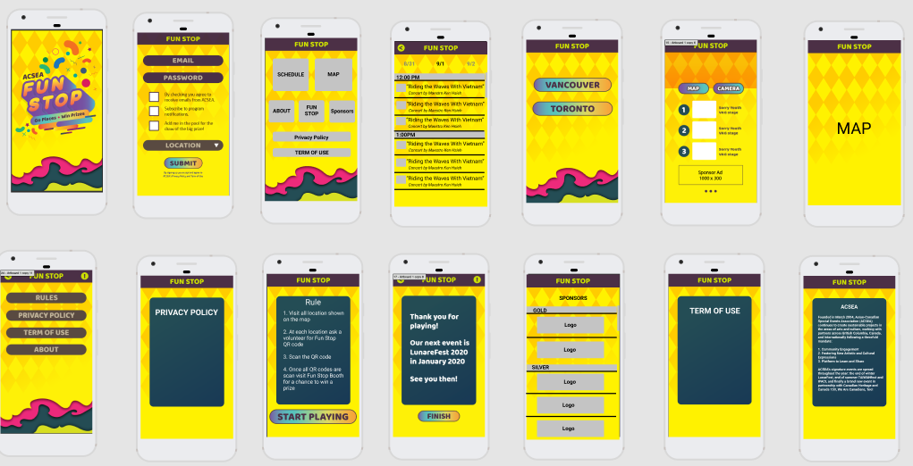

# TAIWANfest FunStop App Android Version
This project is built for 2019 TAIWANfest as an event app for festival attendees. 
The app replace a paper passport type program and help reduce print outs of festival maps and schedule

## Table of contents
* [General info](#general-info)
* [Screenshots](#screenshots)
* [Technologies](#technologies)
* [Features](#features)
* [Status](#status)
* [Inspiration](#inspiration)
* [Contact](#contact)

## General info
TAIWANfest is an annual festival that's held in Toronto and Vancouver. 
For the past few years the festival has been Dialogue with Asia Series, in 2019 the festival was 
themed "Fete with the Philippines" discussing the similarity, difference we have between Taiwan, Canada and the Philippines. 
This is my first mobile App and I completed both iOS and Android version in 3 months. The app was deployed on Google Play and 
Apple Store. 

App Stats:
* Android: 150 users
* iOS: 50 users

Notifcation:
* Send: 8.7K
* Received: 3.9K (Android and partially iOS)
* Impressions: 3.8K (Android Only)

## Screenshots

## Technologies
* Java
* Firebase Realtime Databese

## Features
List of features ready and TODOs for future development
* Collect user data to add to newsletter
* Allow user to receive notifcation of events
* Display festival schedules order by dates and classified by categories/location
* Display festival maps
* Display festival sposors
* Fun Stop Program - allow user to scan QR code to check in at various location 

## Status
Project is: _finished_

## Contact
Created by [@jasonwei0224](www.linkedin.com/in/jasonwei0224) - feel free to contact me!
